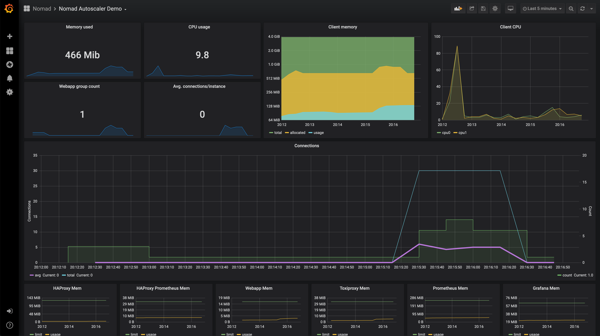

# Vagrant Nomad Autoscaler Demo
This Vagrantfile and associated configuration and job files are meant to provide a basic demo for running and using the Nomad Autoscaler. The demo will enable autoscaling on an example web application, showing both scaling in and scaling out.

### Requirements
To use the Vagrant environment, first install Vagrant following these [instructions](https://www.vagrantup.com/docs/installation/). You will also need a virtualization tool, such as [VirtualBox](https://www.virtualbox.org/).

## Start the Virtual Machine
Vagrant is used to provision a virtual machine which will run a Nomad server and client for scheduling work. To create the virtual machine, you should run the `vagrant up` command.
```
$ vagrant up
```
This will take a few minutes as the base Ubuntu box must be downloaded and provisioned with both Docker and Nomad. Once this completes, you should see this output.
```
Bringing machine 'default' up with 'virtualbox' provider...
==> default: Importing base box 'ubuntu/bionic64'...
...
==> default: Running provisioner: deps (shell)...
```
At this point the Vagrant box is running and ready to go.

## Start the Nomad Base Jobs
In order to start the Nomad jobs you should ssh onto the vagrant machine using the `vagrant ssh` command and navigate to the jobs directory.

```
$ vagrant ssh
$ cd /home/vagrant/nomad-autoscaler/jobs/
```

The demo uses [HAProxy](https://www.haproxy.org/) to provide ingress services. The job also includes a Prometheus exporter, which allows HAProxy metrics to be exported for consumption via Prometheus. This should be started using the `nomad run` command.
```
$ nomad run haproxy.nomad
```

You can check the status of the job and the allocation using the `nomad status` command.
```
$ nomad status haproxy
$ nomad status <alloc-id>
```

Prometheus can now be started, again using the `nomad run` command. The virtual machine is set to forward a number of ports to your localhost, including the Prometheus UI. This can be seen in a web browser at http://127.0.0.1:9090.
```
$ nomad run prometheus.nomad
```

To visualize the state of the system and better understand what actions are being taken by the Autoscaler, you can run the Loki and Grafana services which comes with a sample dashboard that can be accessed from your browser at [http://localhost:3000/d/8QlvShyZz/nomad-autoscaler-demo](http://localhost:3000/d/8QlvShyZz/nomad-autoscaler-demo?orgId=1&refresh=5s).

```
$ nomad run loki.nomad
$ nomad run grafana.nomad
```

We will explore the details of each panel shortly.

## Start the Autoscaler Component Jobs
First start the Nomad job which will be autoscaled. The `webapp.nomad` jobfile contains a scaling stanza which defines the key autoscaling parameters for a task group. There are a number of interesting key options to understand.
- `enabled = false` is a parameter to allow operators to administratively disable scaling for a task group.
- `source = "prometheus"` specifies that the Autoscaler will use the Prometheus APM plugin to retrieve metrics.
- `query  = "scalar(avg((haproxy.."` is the query that will be run against the APM and is expected to return a single value.
- `strategy = { name = "target-value" }` defines the calculation strategy the Autoscaler will use, in this case we a targeting a value.

Register the application to Nomad, so Nomad can start 3 allocations of the example web application.
```
$ nomad run webapp.nomad
```

The Autoscaler Nomad job can now be submitted. The Nomad Autoscaler does not require persistent state, but will store key data in-memory to reduce load on the Nomad API.
```
$ nomad run autoscaler.nomad
```
Check the logs of the Autoscaler to see that it has started up correctly.
```
$ nomad logs -stderr <alloc-id>
```

## Enable the Scaling Policy and Scale Down
The submitted webapp job has a scaling stanza, but has scaling disabled. In order to enable the task group for scaling, you should edit the file and change the `enabled = false` line to read `enabled = true` within the scaling stanza. Once updated, preview what changes are to be made using the `nomad plan` command.
```
$ nomad plan webapp.nomad
```
Submit the updated version of the job, taking the index generated from the plan command.
```
$ nomad run -check-index <index-from-plan> webapp.nomad
```
The Autoscaler will now actively evaluate the example group of the webapp job, and will determine that the current count 3, is more than is needed to meet the required scaling target.
```
2020-03-25T17:17:02.725Z [INFO]  agent: reading policies: policy_storage=policystorage.Nomad
2020-03-25T17:17:02.726Z [INFO]  agent: found 1 policies: policy_storage=policystorage.Nomad
2020-03-25T17:17:02.727Z [INFO]  agent: fetching current count: policy_id=248f6157-ca37-f868-a0ab-cabbc67fec1d source=prometheus strategy=target-value target=local-nomad
2020-03-25T17:17:02.729Z [INFO]  agent: querying APM: policy_id=248f6157-ca37-f868-a0ab-cabbc67fec1d source=prometheus strategy=target-value target=local-nomad
2020-03-25T17:17:02.731Z [INFO]  agent: calculating new count: policy_id=248f6157-ca37-f868-a0ab-cabbc67fec1d source=prometheus strategy=target-value target=local-nomad
2020-03-25T17:17:02.731Z [INFO]  agent: next count outside limits: policy_id=248f6157-ca37-f868-a0ab-cabbc67fec1d source=prometheus strategy=target-value target=local-nomad from=3 to=0 min=1 max=10
2020-03-25T17:17:02.731Z [INFO]  agent: updated count to be within limits: policy_id=248f6157-ca37-f868-a0ab-cabbc67fec1d source=prometheus strategy=target-value target=local-nomad from=3 to=1 min=1 max=10
2020-03-25T17:17:02.731Z [INFO]  agent: scaling target: policy_id=248f6157-ca37-f868-a0ab-cabbc67fec1d source=prometheus strategy=target-value target=local-nomad target_config="map[group:demo job_id:webapp]" from=3 to=1 reason="capping count to min value of 1"
```
The Autoscaler will never scale a job group past either the `min` or `max` parameters. This ensures applications maintain high availability even during minimal load, while also not over scaling due to problems such as misconfiguration or faulty metrics values.

## Generate Load and Scale Up
In order to generate load, a tool called [hey](https://github.com/rakyll/hey) is installed and available on the virtual machine. It is recommended to create a second ssh connection to the virtual machine. Inside this terminal we can then generate load on the webapp service.
```
$ hey -z 1m -c 30 http://127.0.0.1:8000
```

The increase in load will be reflected through Prometheus metrics to the Autoscaler. Checking the Autoscaler logs, you should see messages indicating it has chosen to scale out the job due to the increase in load.
```
2020-03-25T17:23:12.725Z [INFO]  agent: reading policies: policy_storage=policystorage.Nomad
2020-03-25T17:23:12.727Z [INFO]  agent: found 1 policies: policy_storage=policystorage.Nomad
2020-03-25T17:23:12.728Z [INFO]  agent: fetching current count: policy_id=248f6157-ca37-f868-a0ab-cabbc67fec1d source=prometheus strategy=target-value target=local-nomad
2020-03-25T17:23:12.730Z [INFO]  agent: querying APM: policy_id=248f6157-ca37-f868-a0ab-cabbc67fec1d source=prometheus strategy=target-value target=local-nomad
2020-03-25T17:23:12.735Z [INFO]  agent: calculating new count: policy_id=248f6157-ca37-f868-a0ab-cabbc67fec1d source=prometheus strategy=target-value target=local-nomad
2020-03-25T17:23:12.735Z [INFO]  agent: scaling target: policy_id=248f6157-ca37-f868-a0ab-cabbc67fec1d source=prometheus strategy=target-value target=local-nomad target_config="map[group:demo job_id:webapp]" from=1 to=2 reason="scaling up because factor is 1.500000"
```

## Understanding the dashboard
From the [dashboard](http://localhost:3000/d/8QlvShyZz/nomad-autoscaler-demo?orgId=1&refresh=5s) you will be able to see the actions taken by the Autoscaler:



The green shaded area in the middle of the dashboard is the `count` of the `webapp` task group that the Autoscaler will act on. The blue line is the total number of connections hitting our services and the purple line is the average number of connections per instance of `webapp`, and it's the metric we are monitoring.

You can see that the `count` starts at 3, but drops to 1 after the Autoscaler is started because the average number of connections is at 0. Once we run the `hey` command and start to generate load into our system, the number of connections sharply increases, along with the average.

The Autoscaler notices this spike and reacts a few seconds later by increasing the `count`. This will add more instances of our web app to handle the load and drop the average number of connections to our target value. Once the load is removed, the Autoscaler returns `count` to 1. The log entries for the scaling actions performed by the Autoscaler are automatically added to the graphs as annotations represented by the dashed light blue vertical lines. Hovering over them will display more details about the scaling event.

The actual values you observe might be different, but the general idea of `count` reacting to the average number of connections should be noticeable.

## Demo End
Congratulations, you have run through the Nomad Autoscaler Vagrant demo. In order to destroy the created virtual machine, close all SSH connection and then issue a `vagrant destroy -f` command.
```
$ vagrant destroy -f
```
